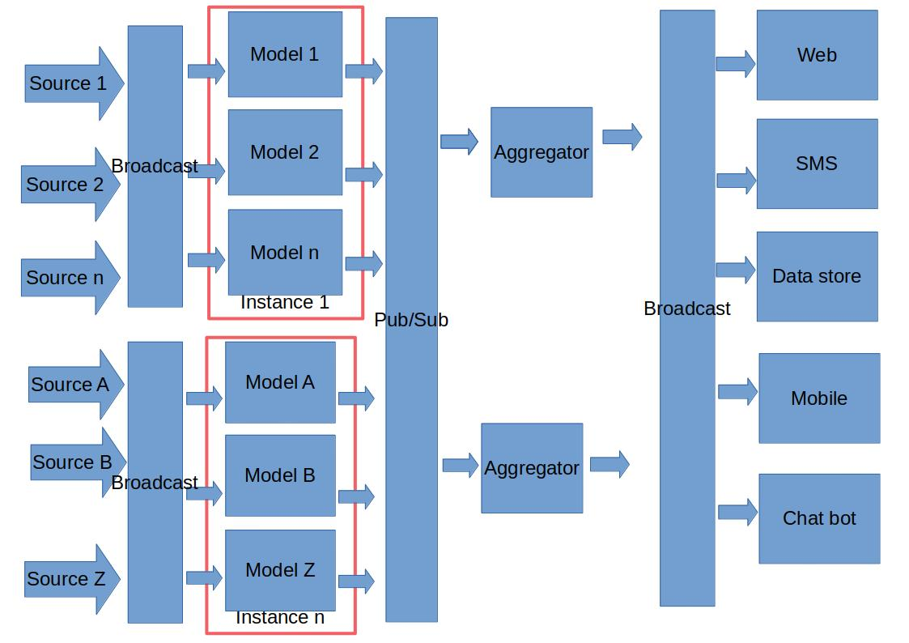

# Video detection
This project aims to detect objects in a video stream then generate data that can be consumed by various clients e.g. SPA apps, chat bots etc.

It comprises of a python script that uses pretrained tensorflow models for out of the box inference.

## Envisioned Architecture

The system is conceived as micro services which will communicate via publish/subscribe queues.

A **source** could be a video file, a network stream, a directory of images.
The service that reads the source is also aware of the instance name from the configuration. The source creates a message with a unique ID.

The **source** pushes the message into a channel where services that communicate with **model services (models)** receive messages.

At the time of pushing the message, a shared counter, say counter <msg-id>-in, with identified by the message ID is created with the total number of **model services**
 that received the message for processing.

After each **model service** produces some detection results, those results are placed on a publish/subscribe channel where all related results are aggregated.
The aggregation can be handled by via another shared counter, say counter <msg-id>-out which is incremented by each model service upon receiving the message from the **source**.

Once the two counters are equal, the message is placed on another broadcast channel where other services take the message and deliver it appropriately.

## Conda Setup
Run `conda create --name <env> --file package-list-linux-64.txt` to setup a conda environment

## Handler Service Setup
It is possible to transmit the results of a detection to a detection handling service for more processing - e.g. visualizing boxes, database storage.

To (re)generate the client, server grpc code, follow the steps below.

* Generate the code - `python -m grpc_tools.protoc -I proto --grpc_python_out=proto/generated/ --python_out=proto/generated proto/detection_handler.proto`

## Running with Tensorflow Serving (Docker)
- clone or download the [tensorflow serving repo](https://github.com/tensorflow/serving/blob/master/tensorflow_serving/apis/prediction_service.proto)
- Download or clone the [tensorflow core repo](https://github.com/tensorflow/tensorflow). This will make available several models that can be used to run inferences.
- generate the tensor flow prediction service python grpc stubs - note the tensorflow core and tensorflow serving repo local roots have been given to resolve the protobuf dependencies

 `python -m grpc_tools.protoc -I ~/tensorflow-serving-repo/ -I ~/tensorflow-core-repo --grpc_python_out=proto/generated/ --python_out=proto/genera
ted ~/tensorflow-serving-repo/tensorflow_serving/apis/*.proto`

- add the generated python code to the python path

 `export PYTHONPATH=.:proto/generated:proto/generated/tensorflow_serving/apis`

- [setup](https://www.tensorflow.org/tfx/serving/docker) and start the tensor flow serving docker container

   `sudo docker run -p 8501:8501 -p 8500:8500 --mount type=bind,source=/home/mugo/downloaded-tensorflow-models/ssd_mobilenet_v1_coco_2017_11_17/,target=/models/ssd_mobilenet_v1_coco -e MODEL_NAME=ssd_mobilenet_v1_coco -t tensorflow/serving`

- Run video detection script

 `python detect_video_stream_tf_serving.py ~/Videos/train-passenger-foot-stuck.mp4  ~/tensorflow-models-repo/research/object_detection/data/mscoco_complete_label_map.pbtxt 8500 ssd_mobilenet_v1_coco --cutoff 70 --handler_port=50001`

## Running Directly with Tensorflow Libraries (Conda or alternatives)
- Download or clone the [tensorflow core repo](https://github.com/tensorflow/tensorflow). This will make available several models that can be used to run inferences.
- add the generated python code to the python path

   `export PYTHONPATH=.:[qualified/path/to/]proto/generated/`

- start the sample standard output detection handler

  `python samples/stdout_detection_handler.py`

- Attempt to detect objects in a video. This example uses the ssd_mobilenet_v1_coco_2017_11_17 model in the downloaded tensorflow repo

  `python detect_video_stream_tf_libs.py ~/Videos/train-passenger-foot-stuck.mp4 ~/tensorflow-models-repo/research/object_detection/ssd_mobilenet_v1_coco_2017_11_17/frozen_inference_graph.pb ~/tensorflow-models-repo/research/object_detection/data/mscoco_complete_label_map.pbtxt --cutoff 70 --handler_port=50002`

## Related Projects
- https://github.com/kunadawa/object-detection-event-web-server
- https://github.com/kunadawa/object-detection-react-app

## Resources
- <https://towardsdatascience.com/detecting-pikachu-in-videos-using-tensorflow-object-detection-cd872ac42c1d>
- <https://github.com/tensorflow/models/blob/master/research/object_detection/object_detection_tutorial.ipynb>
- https://www.semantics3.com/blog/a-simplified-guide-to-grpc-in-python-6c4e25f0c506/
- https://medium.com/innovation-machine/deploying-object-detection-model-with-tensorflow-serving-part-3-6a3d59c1e7c0
- https://medium.com/@yuu.ishikawa/how-to-show-signatures-of-tensorflow-saved-model-5ac56cf1960f
- other credits are given in code and commit comments.

## Licensing
MIT

## Contributors
Eric Njogu
